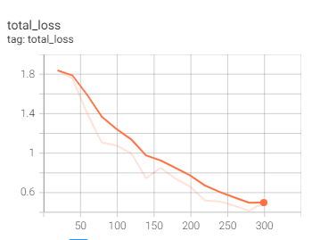
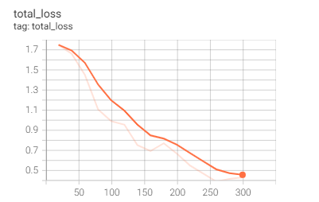

# DeepMirrorTask

### Model Structure:

1) Notebook Folder: This contains the notebook used in training and running inference on the model.
2) Images: This contains the total training loss for training sessions when feature noise was added, and when feature noise was not added.

### Procedure Taken:

1) Pytorch implementation of MaskRCNN used is the detectron2 framework. Cloned Repository can be found [here](https://drive.google.com/drive/folders/13Rx9_MBTskwU5TsZXGHITu06SNQnqyo6?usp=sharing).

2) A subset of the coco dataset was used with a single class. Link to the dataset used can be found [here](https://drive.google.com/drive/folders/18Tf_K4bwFgPieSTxdP_Jqavv5ZhRWuTX?usp=sharing).

3) Addition of the Feature noise was done [here](https://drive.google.com/file/d/1YNlQWaL1a0UHPEHCXPASzTyORGy6a4HM/view?usp=sharing), in the local detectron2 architecture folder.
Notebook training with and without the addition of feature noise can be found here respectively: [Link 1](https://github.com/kene111/DeepMirrorTask/blob/main/NoteBooks/Deep_Mirror_ML_Task_Feature_Noise.ipynb),
[Link 2](https://github.com/kene111/DeepMirrorTask/blob/main/NoteBooks/Deep_Mirror_ML_Task_No_Feature_Noise.ipynb)

4) Comparing of Total training Loss is displayed below:

###  Total Training Loss with Feature Noise:

### Total Training Loss without Feature Noise

As seen above, the training loss of the model without feature was lower than that of the model with feature noise but both models still had good performance.
### To reproduce the Results:

Run the provided notebooks

1) Make sure to properly link the local detectron2 folder to the notebook.
2) Make sure the path to the dataset is propely written
3) When training using feature noise, visit rcnn.py in the detectron2 folder and un-comment the logic that adds noise to the feature space. Save, restart and run notebook.
To locate the [rcnn.py](https://drive.google.com/file/d/1YNlQWaL1a0UHPEHCXPASzTyORGy6a4HM/view?usp=sharing). Below is the path way to find the rcnn.py

detectron2 -> detectron2-> modelling -> meta_arch -> rcnn.py

3) To run notebook without adding noise, comment out the noise adding logic in rcnn.py file. Save, restart and re-run the notebook.
